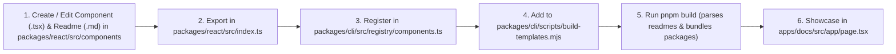

# AGENTS.md — Developer & AI Agent Guidelines

> **Project**: Noetic UI  
> **Repository**: [github.com/becks256/agent-ui](https://github.com/becks256/agent-ui)  
> **Packages**: `@noetic-ui/react` (Component Library) • `@noetic-ui/cli` (CLI Tool) • `docs` (Next.js 15 App)

---

## 1. Overview & Architecture

**Noetic UI** (_from the Greek noēsis / nous — intellect, thought, mind_) is a high-design, open-source component library and CLI built specifically for **cognitive AI, streaming Chain-of-Thought (CoT) reasoning, tool invocations, and multi-agent workflows**.

### Monorepo Structure

```text
agent-ui/
├── apps/
│   └── docs/            # Next.js 15 documentation, theme studio, and live agent simulator
├── packages/
│   ├── react/           # Core React component library (@noetic-ui/react)
│   └── cli/             # shadcn-style CLI for copying unbundled components (@noetic-ui/cli)
├── pnpm-workspace.yaml  # pnpm workspace definition (packages/*, apps/*)
├── turbo.json           # Turborepo build pipeline and task dependency graph
├── vercel.json          # Zero-config Vercel monorepo deployment config
└── package.json         # Monorepo root package.json
```

---

## 2. Core Development Commands

This monorepo uses **pnpm** (v10+) and **Turborepo** (v2+).

```bash
# Install all dependencies across workspaces
pnpm install

# Start development servers (docs on http://localhost:3000, tsup --watch on packages)
pnpm dev

# Build all packages in topological order
pnpm build

# Typecheck all TypeScript code
pnpm typecheck

# Run linter
pnpm lint

# Run test suites
pnpm test
```

### Turborepo Build Pipeline (`turbo.json`)

The build pipeline enforces dependency ordering:

1. `@noetic-ui/react` compiles via `tsup` (ESM `dist/index.mjs`, CJS `dist/index.js`, DTS `dist/index.d.ts`).
2. `@noetic-ui/cli` runs `prebuild` (`node scripts/build-templates.mjs`) to package all 25 source files into `src/registry/templates.ts`, then builds with `tsup`.
3. `apps/docs` compiles with `next build`, consuming `@noetic-ui/react` from the workspace.

---

## 3. Design System & Surface Elevation

Noetic UI uses a calibrated **4-tier surface elevation system** and dynamic **continuous HSL color tokens** with automated WCAG 2.1 AAA contrast calculations.

### Surface Elevation System

| Layer / Role            | Dark Mode Token            | Light Mode Token             | Purpose                             |
| :---------------------- | :------------------------- | :--------------------------- | :---------------------------------- |
| **Canvas / Background** | `240 10% 3.9%` (`#0a0a0c`) | `240 5% 97.5%` (`#f8f9fa`)   | Deep canvas backdrop                |
| **Cards & Containers**  | `240 5% 10%` (`#18181c`)   | `0 0% 100%` (`#ffffff`)      | Component cards, chat surfaces      |
| **Modals & Popovers**   | `240 6% 12.5%` (`#1f1f24`) | `0 0% 100%` (`#ffffff`)      | Dropdowns, tooltips, dialogs        |
| **Secondary / Pills**   | `240 4% 16.5%` (`#28282e`) | `240 4.8% 93.5%` (`#edeef2`) | Badges, subtask tags, inactive tabs |
| **Borders**             | `240 4% 20%` (`#313138`)   | `240 5.9% 88%` (`#dcdee4`)   | Structural dividing lines           |

### Dynamic Theme & Contrast Engine (`getContrastMetrics`)

- Color tokens are defined via continuous HSL variables: `--primary-hue`, `--primary-sat`, `--primary-light`, and `--primary`.
- `getContrastMetrics(hue, sat, light)` calculates relative luminance and automatically flips `--primary-foreground` between pure white (`0 0% 100%`) and dark ink (`240 10% 3.9%`) to guarantee AA/AAA accessibility on any chosen hue.

---

## 4. The 7 Architectural Suites (23 Components)

1. **Reasoning & Tools (4)**: `ReasoningAccordion`, `ToolCallCard`, `AgentPlanView`, `AgentSwarmView`
2. **Messages & Streaming (4)**: `MessageBubble`, `StreamingText`, `BranchSwitcher`, `ChatContainer`
3. **Input & Prompting (5)**: `PromptInput`, `DragAndDropUploader`, `ContextTray`, `SlashCommandMenu`, `ModelSelector`
4. **Human-in-the-Loop (3)**: `ActionConfirmationModal`, `InteractiveQuestionCard`, `FeedbackActions`
5. **Artifacts & Canvas (4)**: `ArtifactWorkspace`, `CodeBlock`, `DiffViewer`, `TerminalStream`
6. **Telemetry & States (2)**: `AgentStatusBadge`, `TokenUsageMeter`
7. **Theme & Customization (1)**: `ThemeColorPicker`

---

## 5. Adding or Modifying Components

When authoring a new component or modifying an existing one, agents **must** complete the full lifecycle:



### Detailed Steps:

1. **Implement Component & Author Readme**:
   - Component: `packages/react/src/components/<suite>/<ComponentName>.tsx`.
   - Documentation: `packages/react/src/components/<suite>/<ComponentName>.md`. Includes frontmatter (suite, dependencies), props table, types, basic & advanced usage.
   - Use `'use client'` at the top if the component contains interactivity, hooks, or `framer-motion`.
   - Use `cn(...)` from `../../utils/cn` for class merging.
   - Import shared types from `../../types`.

2. **Export Component**:
   - Add the export in `packages/react/src/index.ts`.

3. **Register in CLI Registry**:
   - Update `packages/cli/src/registry/components.ts`:
     ```ts
     ComponentName: {
       name: 'ComponentName',
       suite: '<Suite Number>. <Suite Name>',
       suiteId: '<suiteId>',
       description: '<Brief description>',
       dependencies: ['lucide-react', 'framer-motion'],
       internalDependencies: ['types', 'cn', ...otherInternalComponents],
     }
     ```

4. **Register in Prebuild Template Bundler**:
   - Add file entry in `packages/cli/scripts/build-templates.mjs` array `componentFiles`:
     ```js
     { key: 'ComponentName', relPath: 'components/<suite>/<ComponentName>.tsx', targetFilename: '<ComponentName>.tsx' }
     ```

5. **Build & Verify**:
   - Run `pnpm build` to execute `prebuild` for CLI templates, `prebuild` for docs (parsing all `.md` files to `apps/docs/src/data/component-docs.ts`), bundle `@noetic-ui/react`, build `@noetic-ui/cli`, and compile `apps/docs`.

6. **Add to Documentation & Gallery**:
   - Add interactive live preview to `apps/docs/src/app/page.tsx`.

---

## 6. Coding Standards & Conventions

- **TypeScript**: Strict mode enabled. Provide explicit interfaces for component props and state types in `packages/react/src/types/index.ts`.
- **Styling**: Tailwind CSS utility classes with CSS custom variables (e.g. `bg-card`, `text-card-foreground`, `border-border`, `bg-primary`, `text-primary-foreground`). Avoid hardcoded arbitrary color values like `bg-[#121214]`.
- **Icons**: Always use `lucide-react`.
- **Animations**: Use `framer-motion` for transitions, smooth accordion expansions, state halo pulses, and modals.
- **Import Normalization**: Components inside `packages/react` must use relative imports (e.g. `../../utils/cn`, `../../types`, `../reasoning/ReasoningAccordion`). The CLI template builder automatically normalizes these for standalone project extraction.

---

## 7. Publishing & Deployment

### npm Publishing (`@noetic-ui/react` and `@noetic-ui/cli`)

Both packages are configured with:

```json
"license": "MIT",
"publishConfig": { "access": "public" }
```

To publish from root:

```bash
pnpm publish -r --access public
```

### Vercel Deployment (`apps/docs`)

- Turborepo-enabled Vercel configuration is in [`vercel.json`](file:///home/kestrel/projects/agent-ui/vercel.json).
- Build command: `turbo run build --filter=docs`
- Framework preset: `nextjs`
